<div align="center">


# nEdit – LaTeX Studio

**Ein nativer LaTeX-Editor in Rust – gebaut für die Masterarbeit an der TU Graz.**<br>
Live-PDF wie bei Overleaf, ein visueller Schreibmodus, eine Literatur-Bibliothek,
Präsentationen im TU-Graz-Design und Git – alles offline, alles in einer App.

<sub>A native, offline Overleaf-style LaTeX studio written in Rust (egui) – with live PDF preview, a visual writing mode, a paper library, Beamer slides and Git.</sub>

[](https://github.com/jwm3000/nedit/actions/workflows/ci.yml)


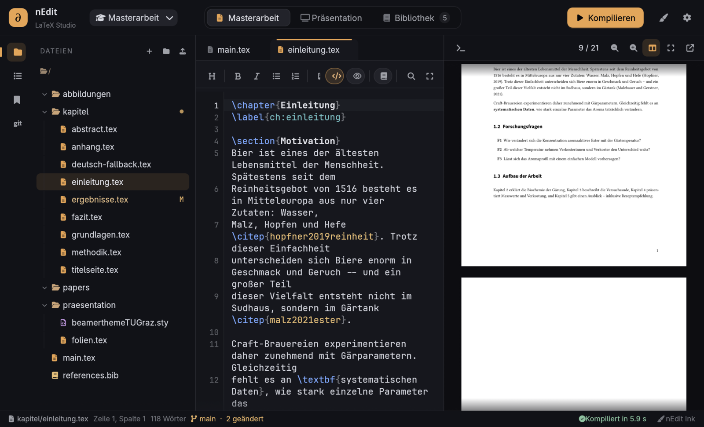

</div>

---

## Inhalt

- [Was nEdit kann](#was-nedit-kann)
- [Sofort loslegen: TU-Graz-Vorlagen](#sofort-loslegen-tu-graz-vorlagen)
- [Beispiel: eine (erfundene) Masterarbeit über Bier](#beispiel-eine-erfundene-masterarbeit-über-bier)
- [Installation](#installation) · [Updates](#3-aktualisieren)
- [Tastenkürzel](#tastenkürzel)
- [Projektaufbau](#projektaufbau)
- [Plattformen & Status](#plattformen--status)
- [Lizenz & Hinweise](#lizenz--hinweise)

---

## Was nEdit kann

### ✍️ Schreiben wie bei Overleaf – nur nativ und offline

Dateibaum, Editor und PDF nebeneinander. **Strg+S** speichert und kompiliert, das PDF
springt danach automatisch an die Stelle, an der du gerade schreibst (SyncTeX).
Doppelklick ins PDF führt zurück in den Quelltext, Fehler im Protokoll sind anklickbar
und im Editor am Rand markiert.

- LaTeX-Syntaxhervorhebung, Zeilennummern, Suchen & Ersetzen, Fett/Kursiv/Kommentar per Tastenkürzel
- Bausteine-Leiste: Abschnitt, Aufzählung, Abbildung, Tabelle, Gleichung, Fußnote, Zitat, Querverweis
- Gliederung (Kapitel/Abschnitte über alle `\input`/`\include`-Dateien) und Wortzähler
- Kompiliert mit `latexmk` (pdfLaTeX, XeLaTeX oder LuaLaTeX), auf Wunsch automatisch
- Verständliche Hinweise, wenn z. B. `biber` oder ein Sprachpaket fehlt

### ⌨️ Vim-Modus

Im ⚙-Menü lässt sich die Eingabe von **Standard** auf **Vim** umstellen (gilt im Code-Modus –
im visuellen Modus wären unsichtbare Befehlszeichen verwirrend). Unterstützt werden
Normal/Insert/Visual/Visual-Line, Zähler, Bewegungen (`hjkl w b e W B E 0 ^ $ gg G f t ; , % { }`,
`Ctrl-d/u`), Operatoren `d c y > <` mit Textobjekten (`iw aw i{ a{ i( i[ i" i$ ip` – z. B.
`ci{` oder `di$` für LaTeX), `x X s S D C p P r J ~ o O i a I A`, `u`/`Ctrl-r`, `.`-Wiederholung,
`/suche` und `?suche` (rückwärts) mit `n`/`N` sowie `:w` (speichern & kompilieren), `:q`, `:wq`, `:{zeile}`,
`:%s/alt/neu/g` und `:noh`. **Strg+V** startet die Block-Auswahl (`d y c r ~ > < I A $`) –
z. B. `Strg+V jj I% Esc` kommentiert drei Zeilen aus. Der Modus steht als Badge in der Statusleiste.

### 🔎 Schnellsuche (2× Umschalt)

Zweimal kurz **Umschalt** drücken (oder **Strg+P**) öffnet ein schwebendes Suchfeld über
allem: zuletzt geöffnete Dateien, alle Projektdateien, Kapitel und Abschnitte (aus Arbeit
und Folien), Literatur (Enter fügt `\citep{…}` ein) und Befehle – mit Unschärfesuche.
Präfixe: `#` Gliederung, `@` Literatur, `>` Befehle, `:42` springt zu Zeile 42.

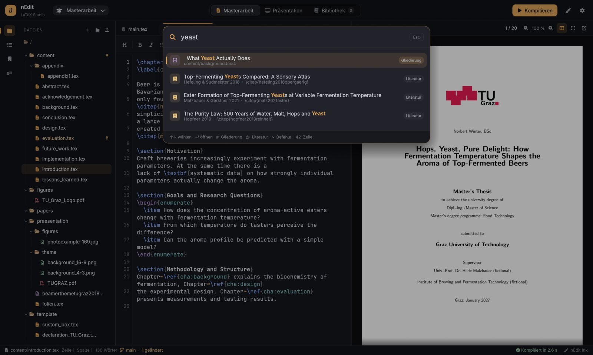

### ⚡ Autovervollständigung & smartes Tippen

Wie bei Overleaf: Nach `\begin{itemize}` + Enter steht das passende `\end{itemize}` schon da
(bei Listen mit erstem `\item`, bei Abbildungen und Tabellen mit Gerüst). Klammern werden
paarweise gesetzt, Enter setzt Listen fort und behält die Einrückung. Die Vorschläge kennen
über 100 Befehle mit Beschreibung, gängige Pakete, Labels mit ihrem Typ (Abbildung, Tabelle …)
und die Befehle, die du selbst im Dokument verwendest – sortiert nach Häufigkeit.

### ⚡ Autovervollständigung

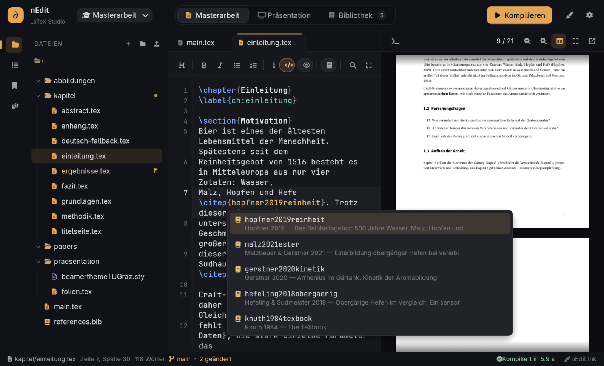

`\cite{` schlägt Einträge aus der Bibliothek vor (mit Autor, Jahr und Titel),
`\cref{` alle Labels, `\begin{` Umgebungen inkl. passendem `\end`, `\input{`/`\includegraphics{` Dateien –
und Befehle ab zwei Buchstaben.

### 👁️ Visueller Modus

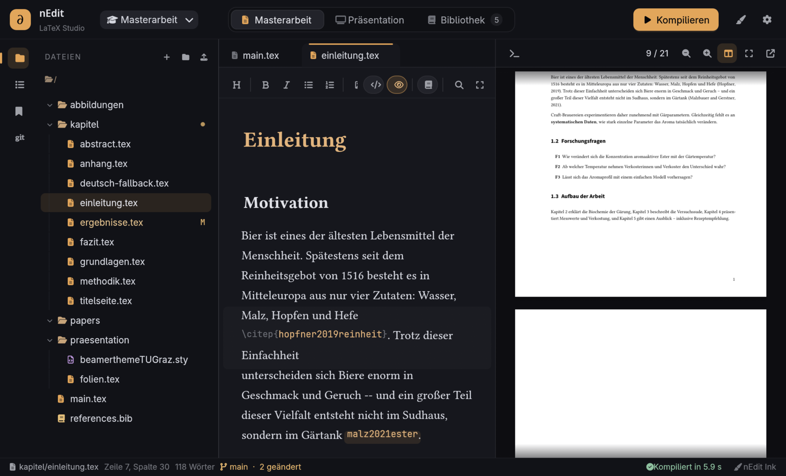

LaTeX-Befehle verschwinden, der Text erscheint gesetzt in Libertinus Serif: Überschriften
groß, `\textbf`/`\emph` fett und kursiv, `\item` als Aufzählungspunkte, Zitate und
Querverweise als Chips, Formeln farbig. **Nur die Zeile mit dem Cursor** zeigt den
Quelltext – so bleibt die Datei immer reines LaTeX. Umschalten mit **Strg+E**.

### 📖 Dokument-Modus & Vollbild

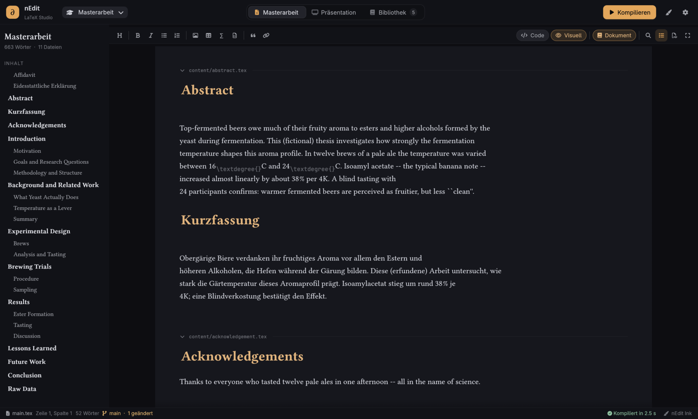

Alle Kapitel aus `main.tex` erscheinen in Lesereihenfolge als **eine durchgehende Seite** –
bearbeitet wird direkt in den einzelnen Dateien. Links ein Inhaltsverzeichnis, die
Papierbreite lässt sich am Rand ziehen.

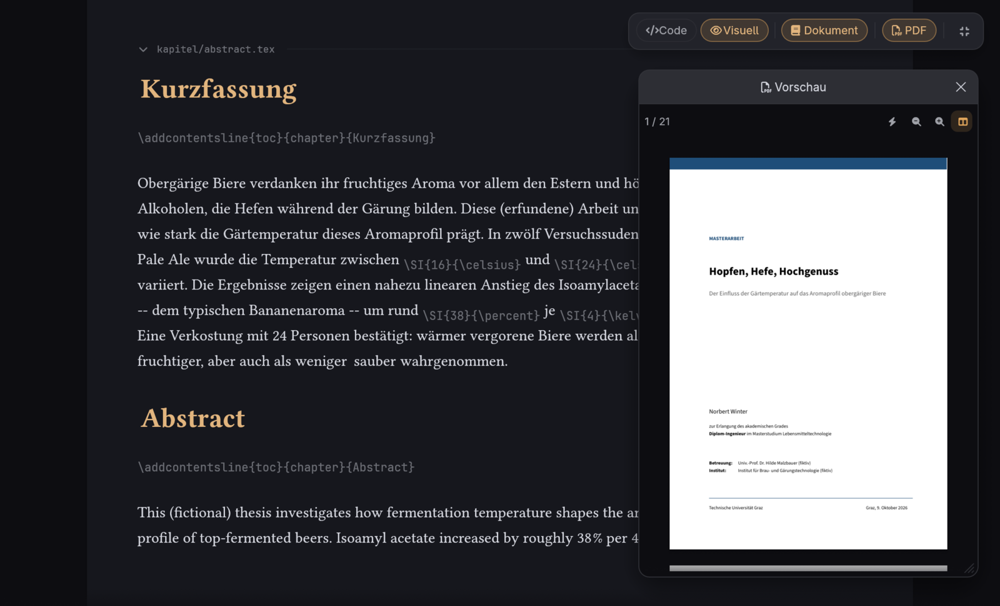

**Vollbild (F11)** zeigt nur noch den Text. Oben rechts erscheint bei Mausbewegung eine
Leiste: Code/Visuell/Dokument umschalten oder ein **schwebendes, verschieb- und
skalierbares PDF** einblenden, das nach jedem Strg+S zur Cursorstelle springt.

### 📚 Bibliothek


Ein Regal für die Literatur der Arbeit – gespeichert in `references.bib`:

- Hinzufügen per **DOI**, **arXiv-ID**, **Titelsuche (Crossref)**, eingefügtem **BibTeX**
  oder **PDF-Import** (die DOI wird aus dem PDF gelesen; PDFs auch per Drag & Drop)
- Lesestatus, Favoriten, Schlagwörter, Notizen, eingebauter PDF-Reader
- „Zitieren“ fügt `\citep{key}` an der Cursorposition ein; lesbare Schlüssel wie `vaswani2017attention`

### 🎤 Präsentation für die Masterprüfung

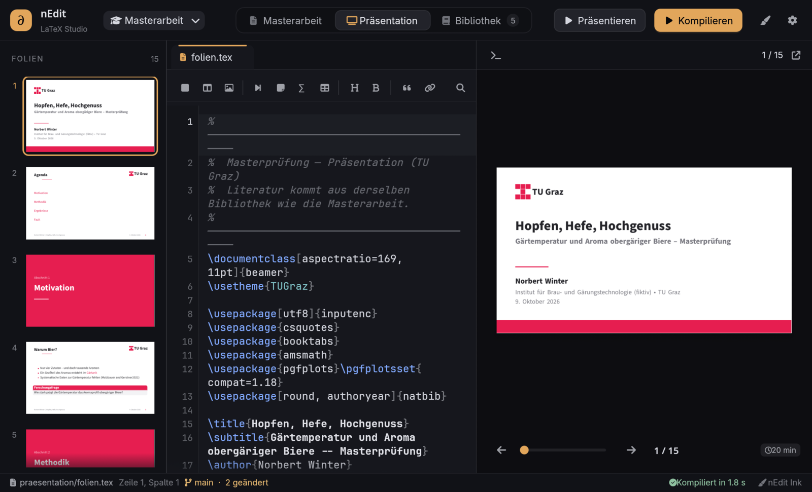

Ein eigener Arbeitsbereich für die Folien mit dem **TU-Graz-Beamer-Theme**:
Filmstreifen aller Folien, Editor mit Folien-Bausteinen (Folie, zwei Spalten, Bildfolie,
schrittweise Aufzählung, Block, Formel …) und eine Bühne, die automatisch die Folie unter
dem Cursor zeigt. Die Literatur kommt aus derselben Bibliothek wie die Arbeit.

**Visueller Folien-Editor:** Mit „Visuell“ bearbeitest du die Folien direkt wie in PowerPoint –
Titel, Aufzählungen (Enter = neuer Punkt, Tab = einrücken), Blöcke, Bilder, Spalten, Formeln
und Pausen. nEdit schreibt dabei sauberes, eingerücktes LaTeX nur für die bearbeitete Folie;
was der Editor nicht kennt (z. B. TikZ-Diagramme), bleibt unverändert als LaTeX-Baustein.

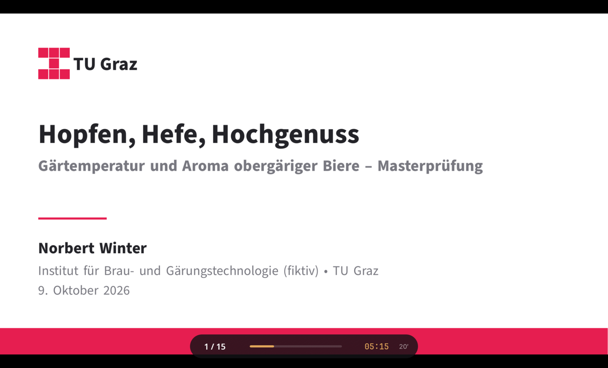

**Präsentieren (F5):** Vollbild mit Timer gegen die Redezeit (wird gelb, dann rot),
`B` für schwarzen Bildschirm, `P` für Pause.

### 🌿 Git

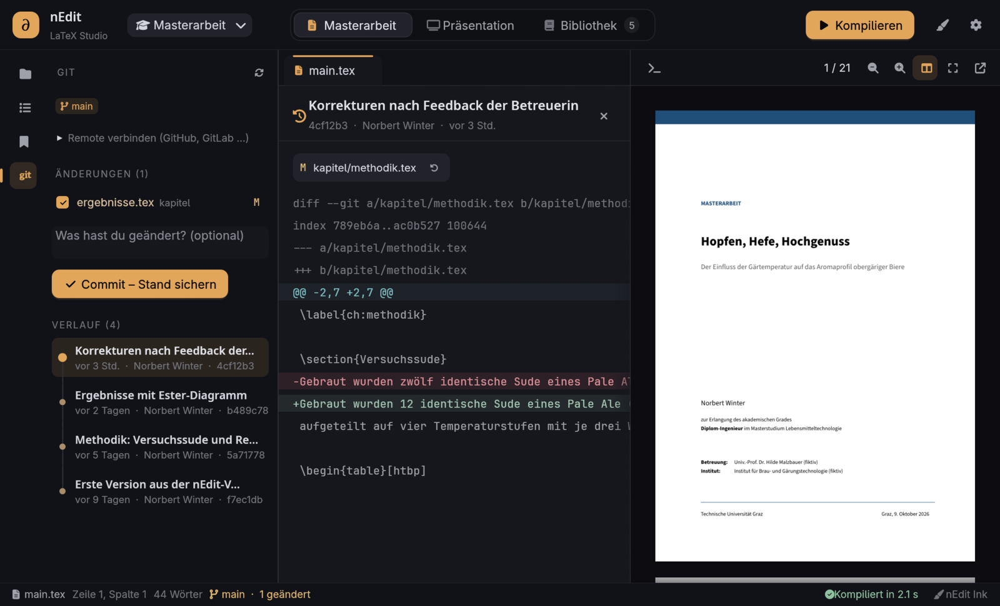

- Repository mit einem Klick anlegen, Commit („Stand sichern“), Push/Pull
- Geänderte Dateien sind im Dateibaum und in den Tabs mit **M**/**N** markiert,
  im Editor zeigen farbige Balken geänderte Zeilen seit dem letzten Commit
- Diff **inline** oder **nebeneinander** (zwei Spalten wie auf GitHub, mit Hervorhebung der geänderten Wörter)
- Verlauf als Zeitleiste, jeder Commit mit Diff – einzelne Dateien lassen sich auf einen
  früheren Stand zurücksetzen
- Änderungen verwerfen per Rechtsklick im Dateibaum (Datei oder Ordner) oder im Git-Panel –
  offene Editoren übernehmen den zurückgesetzten Stand sofort

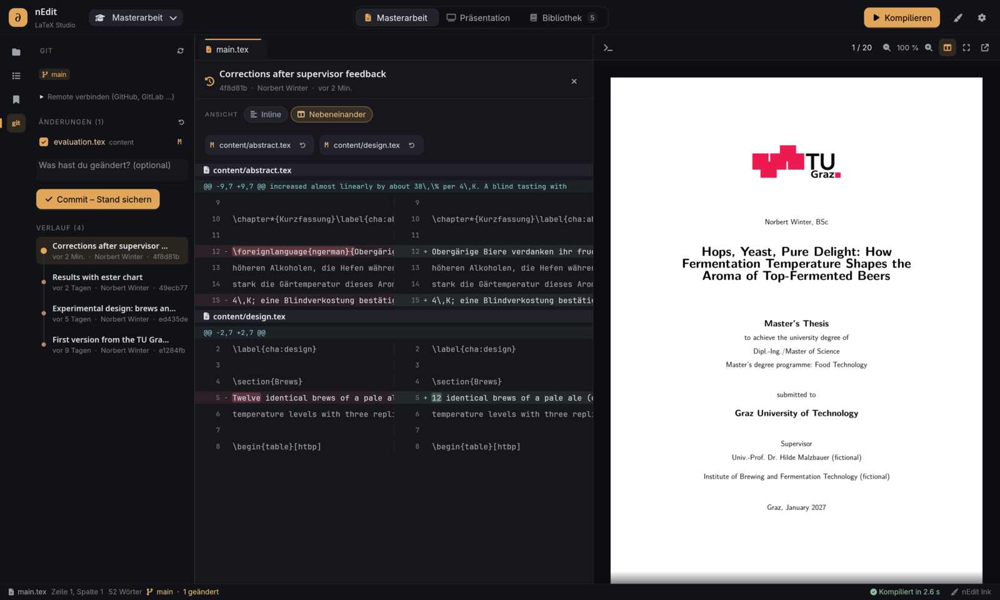

### 🎨 Themes

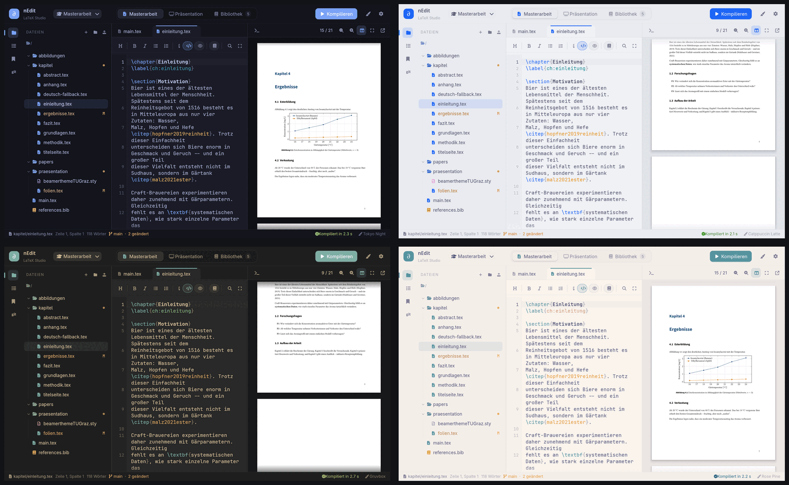

nEdit übernimmt automatisch das aktive [Omarchy](https://omarchy.org)-Theme und wechselt
live mit. Auf **Windows, macOS** und anderen Linux-Systemen stehen **12 eingebaute Themes**
zur Auswahl (Tokyo Night, Catppuccin, Catppuccin Latte, Gruvbox, Nord, Rosé Pine,
Everforest, Kanagawa, Flexoki Light, Matte Black, Osaka Jade, Ristretto) – plus das
eigene „nEdit Ink“. Umschalten über das Pinsel-Symbol oder die Schnellsuche (`> Theme`).

### 📁 Dateien

Ordner anklicken = Zielordner, Dateien direkt im Baum anlegen (Enter/Esc), Drag & Drop
zum Verschieben, Umbenennen mit F2. Neue Kapitel werden automatisch per `\include`
eingebunden, und beim Umbenennen/Verschieben werden `\input`, `\include` und
`\includegraphics` angepasst.

---

## Sofort loslegen: TU-Graz-Vorlagen

Ein neues Projekt startet mit den **offiziellen TU-Graz-Vorlagen**, mit Platzhaltern
befüllt und sofort kompilierbar:

| Masterarbeit | Präsentation (Masterprüfung) |
| --- | --- |
| KOMA-Script-Vorlage für Abschlussarbeiten an der TU Graz (Titelblatt, eidesstattliche Erklärung, Abstract/Kurzfassung, biblatex/APA, Ludografie) | TU-Graz-Beamer-Theme 2018 (Titelfolie, Gliederung, Listen, Bilder, Blöcke, Spalten) |
| `main.tex`, `template/`, `content/*.tex`, `figures/` | `praesentation/folien.tex`, `beamerthemetugraz2018.sty`, `theme/` |

Name, Titel, Betreuung und Institut trägst du oben in `main.tex` bzw. `praesentation/folien.tex`
ein; die Kapitel liegen in `content/`. Neue Kapitel legst du im Dateibaum an – sie werden
automatisch per `\include` in `main.tex` eingebunden.

---

## Beispiel: eine (erfundene) Masterarbeit über Bier

Im Ordner [`examples/bier-masterarbeit`](examples/bier-masterarbeit) liegt das Projekt aus
den Screenshots – die TU-Graz-Vorlagen, befüllt mit **„Hops, Yeast, Pure Delight: How
Fermentation Temperature Shapes the Aroma of Top-Fermented Beers“** von Norbert Winter.
Inhalt, Daten, Quellen und Betreuung sind frei erfunden.

| Masterarbeit (TU-Graz-Vorlage) | Präsentation (TU-Graz-Beamer-Theme) |
| :---: | :---: |
| [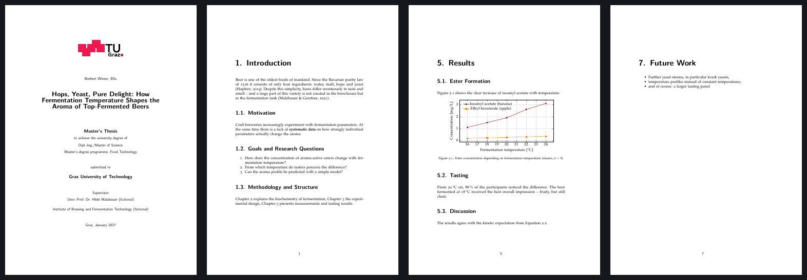](docs/pdf/beispiel-masterarbeit.pdf) | [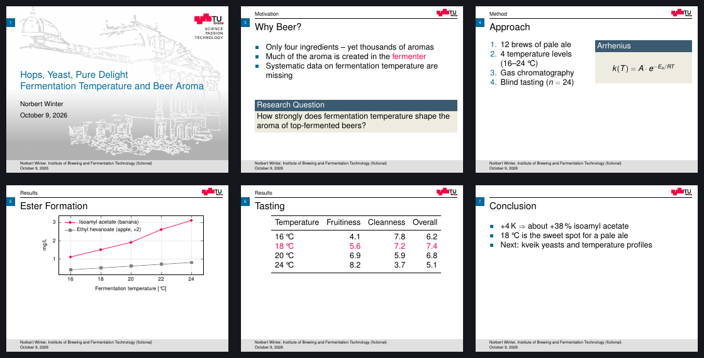](docs/pdf/beispiel-praesentation-tugraz.pdf) |
| [📄 PDF ansehen](docs/pdf/beispiel-masterarbeit.pdf) | [📄 PDF ansehen](docs/pdf/beispiel-praesentation-tugraz.pdf) |

Zum Ausprobieren den Ordner in den Projektordner kopieren:

```sh
cp -r examples/bier-masterarbeit ~/Documents/nEdit-Projekte/Bier
```

---

## Installation

### 1. Abhängigkeiten

nEdit ist ein Editor – gesetzt wird mit einer normalen TeX-Distribution. Benötigt werden:

| Werkzeug | Wofür | Linux (Arch) | Debian/Ubuntu | macOS (Homebrew) | Windows |
| --- | --- | --- | --- | --- | --- |
| **TeX Live** inkl. `latexmk`, `synctex`, `bibtex` | Kompilieren, PDF↔Quelle | `texlive-basic texlive-latexextra texlive-fontsextra texlive-binextra` | `texlive-full` | `brew install --cask mactex` | [TeX Live](https://tug.org/texlive/) oder MiKTeX (+ Perl für latexmk) |
| **biber** | Literaturverzeichnis der Vorlage (biblatex) – **erforderlich** | `biber` | `biber` | in MacTeX enthalten | in TeX Live enthalten |
| **Deutsche Silbentrennung** | Kurzfassung auf Deutsch (optional, sonst nur Englisch) | `texlive-langgerman` | in `texlive-full` | in MacTeX enthalten | in TeX Live enthalten |
| **Poppler** (`pdftoppm`, `pdfinfo`, `pdftotext`) | PDF-Vorschau, PDF-Import | `poppler` | `poppler-utils` | `brew install poppler` | `scoop install poppler` |
| **git** *(optional)* | Versionen & Verlauf | `git` | `git` | `xcode-select --install` | [git-scm.com](https://git-scm.com) |
| **Rust** *(zum Bauen)* | — | `rust` | [rustup](https://rustup.rs) | [rustup](https://rustup.rs) | [rustup](https://rustup.rs) |

Arch / Omarchy in einem Rutsch:

```sh
sudo pacman -S --needed rust texlive-basic texlive-latexextra texlive-fontsextra \
  texlive-binextra texlive-langgerman texlive-science texlive-pictures biber poppler git
```

### 2. Bauen & installieren

```sh
git clone https://github.com/jwm3000/nedit.git
cd nedit
./install.sh          # Linux: baut Release, installiert nach ~/.local/bin + App-Launcher-Eintrag
# oder
cargo run --release
```

Fertige Programme für Linux, Windows und macOS gibt es unter
[Releases](https://github.com/jwm3000/nedit/releases).

### 3. Aktualisieren

nEdit prüft beim Start (abschaltbar im ⚙-Menü), ob es ein neues Release gibt. Dann
erscheint oben rechts **„Update vX.Y.Z“** – ein Klick zeigt die Neuerungen, lädt das
passende Programm von GitHub, tauscht es aus und startet nEdit neu.

```sh
nedit --update     # dasselbe im Terminal
nedit --version
```

Läuft nEdit aus einem geklonten Repository, wird stattdessen
`git pull && ./install.sh` empfohlen.

Rust-Bibliotheken (werden von Cargo automatisch geladen): `eframe`/`egui` (Oberfläche),
`rfd` (Dateidialoge), `ureq` (DOI/Crossref), `serde`/`serde_json`/`toml`, `regex`, `image`,
`dirs`, `chrono`.

---

## Tastenkürzel

| Kürzel | Aktion |
| --- | --- |
| Strg+S | Speichern & kompilieren (PDF springt zur Cursorstelle) |
| Strg+Enter | Kompilieren |
| 2× Umschalt / Strg+P | Schnellsuche (Dateien, Kapitel, Literatur, Befehle) |
| Strg+Tab / Strg+Umschalt+Tab | Nächste / vorherige Datei (Dokument-Modus: Kapitel) |
| F1 | Hilfe mit allen Tastenkürzeln (Deutsch/Englisch) |
| Strg+E | Code ↔ Visuell |
| Strg+L | PDF-Vorschau ein/aus |
| Strg+Umschalt+D | Dokument-Modus |
| F11 / Esc | Vollbild (nur Text) |
| Strg+F | Suchen & Ersetzen |
| Strg+B / Strg+I | Fett / Kursiv |
| Strg+/ | Zeilen (aus)kommentieren |
| Tab / Umschalt+Tab | Einrücken / Ausrücken |
| Strg+Klick | Stelle im PDF zeigen |
| Doppelklick im PDF | Zur Quelltextstelle springen |
| Strg + / Strg − | Editor-Schrift größer / kleiner |
| Alt+1 / 2 / 3 | Masterarbeit / Präsentation / Bibliothek |
| F5 | Präsentieren (←/→, B schwarz, P Pause, T Leiste, Esc) |
| F2 / Entf | Datei umbenennen / löschen (im Dateibaum) |

---

## Projektaufbau

Projekte liegen in `~/Documents/nEdit-Projekte/` (änderbar mit `NEDIT_PROJECTS`).
Ein neues Projekt entsteht aus der Vorlage in [`templates/masterarbeit`](templates/masterarbeit):

```
main.tex                    Hauptdokument: Metadaten (Name, Titel, Betreuung …) und Kapitelliste
template/                   TU-Graz-Vorlage: Präambel, Titelblatt, Erklärung, Typografie
content/*.tex               Kapitel (Introduction, Background, Design, Implementation, …)
content/appendix/           Anhang
figures/                    Abbildungen (enthält das TU-Graz-Logo für das Titelblatt)
references.bib              Bibliothek (BibTeX/biblatex) – wird vom Bibliothek-Tab gepflegt
games.bib                   Ludografie (Spiele als Quellen)
papers/                     PDFs der Bibliothek
praesentation/folien.tex    Masterprüfung (TU-Graz-Beamer-Theme 2018)
praesentation/theme/        Hintergründe und Logo des Themes
.nedit/                     Projekteinstellungen, Bibliotheks-Metadaten, Build-Ausgabe
```

Bestehende Overleaf-Projekte funktionieren ebenfalls: Ordner in den Projektordner legen,
nEdit legt die `.nedit/`-Einstellungen beim ersten Öffnen an.

Quellcode in [`src/`](src): `editor.rs` (Editor & Highlighting), `visual.rs` (visueller
Modus), `pdfview.rs` (PDF-Vorschau), `compile.rs` (latexmk, Log, SyncTeX), `shelf.rs` /
`shelf_ui.rs` (Bibliothek), `git.rs`, `filetree.rs`, `workspace.rs` (Arbeitsbereiche),
`theme.rs` (Themes), `quickopen.rs` (Schnellsuche), `vim.rs` (Vim-Modus), `help.rs` (Hilfe),
`i18n.rs` (Deutsch/Englisch), `updater.rs` (Updates), `platform.rs` (Linux/macOS/Windows).

---

## Plattformen & Status

| Plattform | Status |
| --- | --- |
| Linux (Arch/Omarchy, Wayland/Hyprland) | ✅ entwickelt und getestet |
| macOS | 🟡 baut in der CI, im Alltag noch ungetestet |
| Windows | 🟡 baut in der CI, im Alltag noch ungetestet |

Rückmeldungen und Pull Requests sind willkommen.

---

## Lizenz & Hinweise

- Oberfläche auf **Deutsch** (Standard) oder **Englisch** – umschaltbar im ⚙-Menü.
- nEdit steht unter der [MIT-Lizenz](LICENSE) – © 2026 Norbert Winter.
- **Vorlagen** in [`templates/masterarbeit`](templates/masterarbeit) (nicht Teil der MIT-Lizenz):
  - Thesis: LaTeX-KOMA-Vorlage von Karl Voit et al. ([novoid/LaTeX-KOMA-template](https://github.com/novoid/LaTeX-KOMA-template)),
    TU-Graz-Titelblatt von Stefan Kroboth und Karl Voit – **CC BY-SA 3.0**.
  - Präsentation: TU-Graz-Beamer-Theme 2018 von Maria Eichlseder, angepasst von Michael Krisper
    und Yavuz Koroglu, Design nach der TU-Graz-Vorlage von Christina Fraueneder
    ([latex.tugraz.at](https://latex.tugraz.at/vorlagen/tugraz)).
  - Logos und Corporate Design gehören der TU Graz. nEdit ist ein privates Projekt und steht in
    keiner offiziellen Verbindung zur TU Graz.
- Eingebaute Theme-Farben stammen aus [Omarchy](https://github.com/basecamp/omarchy) (MIT, siehe
  [`assets/themes`](assets/themes)).
- Die Icon-Schrift stammt aus [Nerd Fonts](https://www.nerdfonts.com) (MIT, siehe
  [`assets/fonts`](assets/fonts)). Text- und Serifenschriften werden aus dem System bzw. der
  TeX-Distribution geladen (Libertinus, Source Sans/Code Pro).
- Die Beispiel-Masterarbeit, ihre Daten und Quellen sind frei erfunden.
